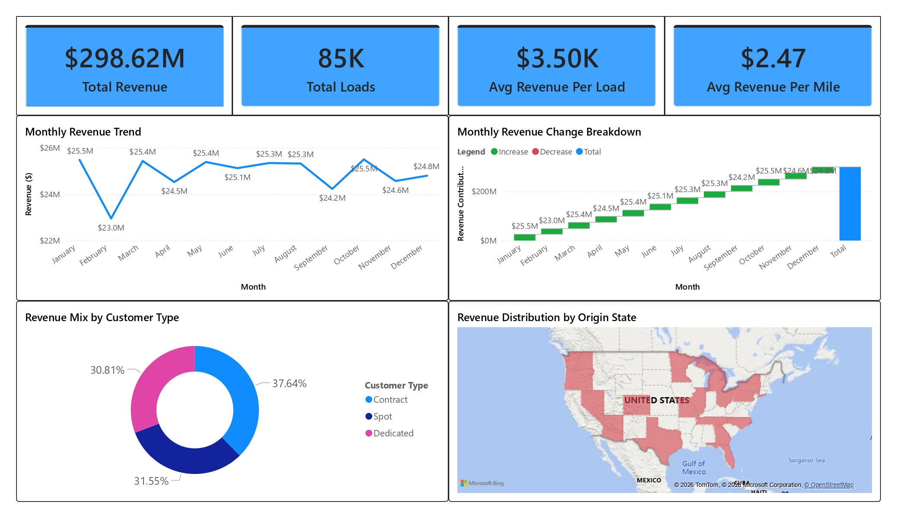
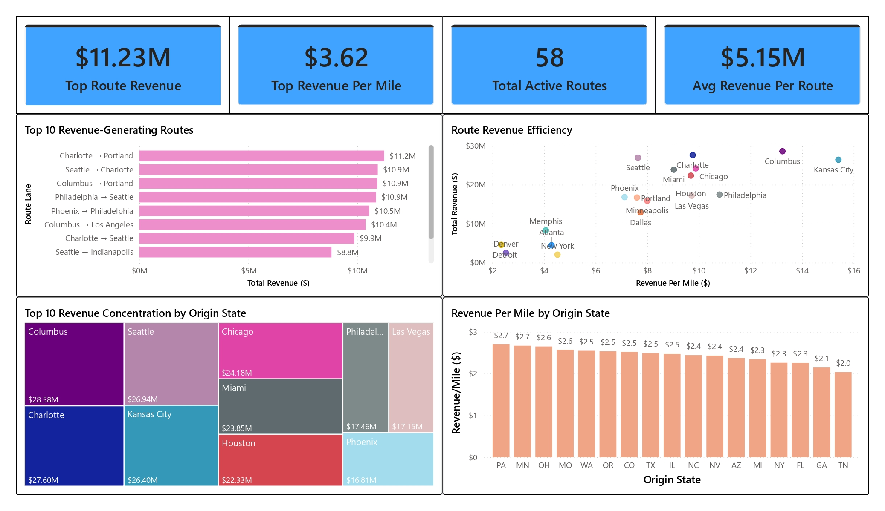
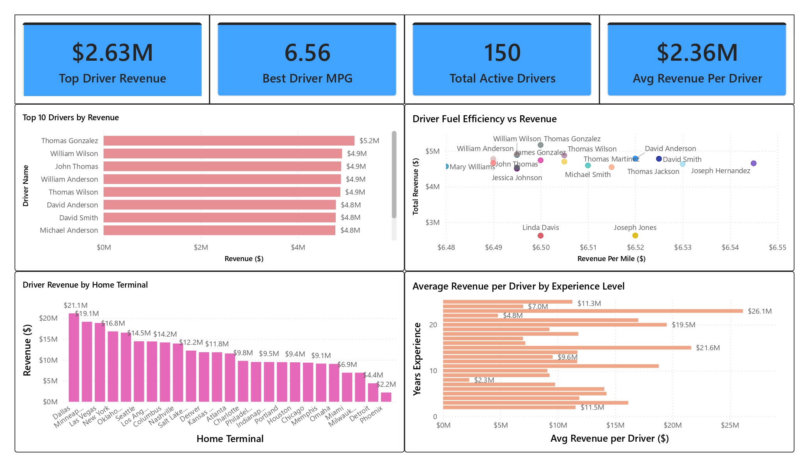
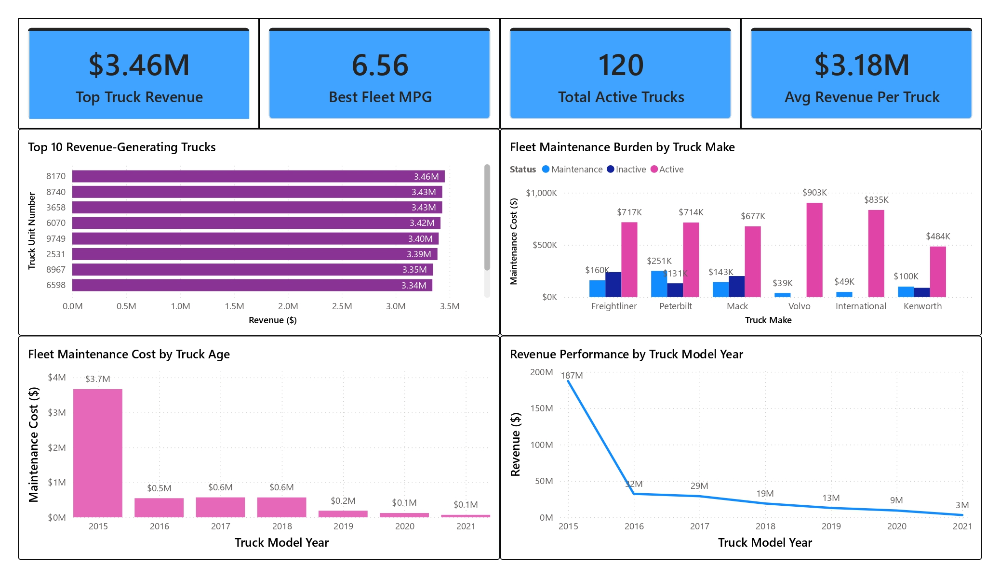
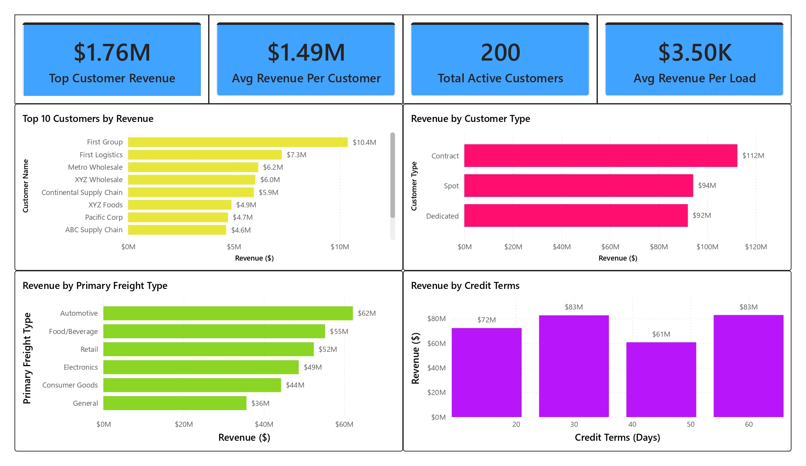
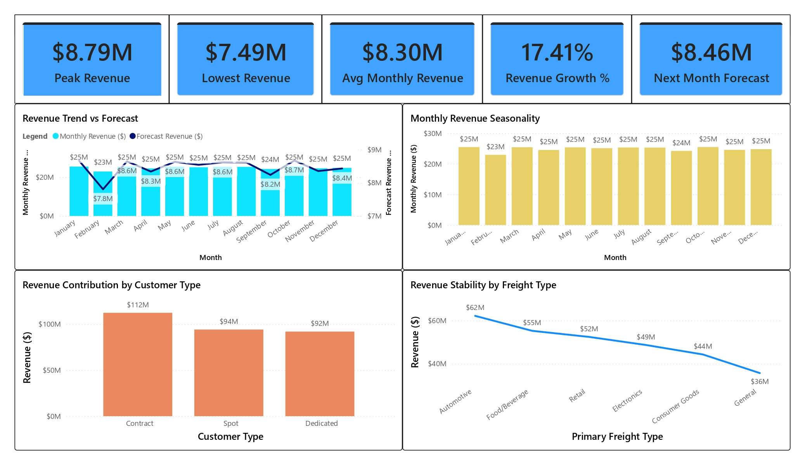

# 🚛 Fleet Profitability & Supply Chain Performance Intelligence Analysis

> A strategic end-to-end SQL & Power BI analysis of logistics revenue, fleet efficiency, route profitability, customer segmentation, and predictive operational performance.

---

## 📌 Overview
This project analyzes large-scale logistics and transportation operations to uncover the key drivers of profitability across revenue generation, route optimization, fleet maintenance, driver productivity, and customer strategy.

By consolidating fragmented logistics datasets into a unified business intelligence framework, this analysis helps leadership identify where margins are strongest, where operational inefficiencies reduce profitability, and how predictive planning can support sustainable growth.

---

## 🎯 Business Problem
Transportation and logistics organizations must continuously balance revenue growth with rising operational complexity.

Leadership teams need visibility into:

- Which routes generate the highest margins  
- How fleet maintenance impacts profitability  
- Which drivers and terminals perform most efficiently  
- Which customer segments create the strongest recurring revenue  
- How predictive forecasting can improve strategic planning  

Without integrated analytics, organizations risk:

- Overinvesting in underperforming routes  
- Retaining inefficient fleet assets  
- Missing high-value customer opportunities  
- Rising operational and maintenance costs  
- Weak forecasting accuracy  
- Reduced long-term profitability  

This project transforms fragmented logistics data into strategic operational intelligence that supports smarter business growth.

---

## 📊 Dashboard Preview

### 💼 Dashboard 1: Executive Revenue Intelligence

### 🛣️ Dashboard 2: Route Profitability & Geographic Optimization

### 🚚 Dashboard 3: Driver Productivity & Operational Benchmarking

### 🔧 Dashboard 4: Fleet Asset Utilization & Maintenance Performance

### 👥 Dashboard 5: Customer Revenue Segmentation & Strategic Growth

### 📈 Dashboard 6: Revenue Forecasting & Strategic Planning

---

## 🧠 Key Insights

- The business generated **$298.62M in total revenue** across **85K freight loads**
- Average operational efficiency reached **$2.47 revenue per mile**
- High-performing routes exceeded **$11.23M in revenue**, highlighting scalable profit centers
- Contract customers generated **$112M**, providing the most stable recurring revenue
- Aging truck assets (particularly 2015 models) created **$3.7M in maintenance burden**
- Driver productivity and terminal performance varied significantly, revealing optimization opportunities
- Revenue forecasting projects **17.41% growth**, with **$8.46M next-month forecasted revenue**
- Freight diversification supports broader long-term revenue resilience

---

## 🛠 Methodology

- SQL-based multi-table data cleaning and transformation  
- Revenue, maintenance, and operational KPI standardization  
- Feature engineering:
  - Revenue per load  
  - Revenue per mile  
  - Route profitability  
  - Driver productivity  
  - Fuel efficiency (MPG)  
  - Fleet maintenance burden  
  - Forecast revenue growth  
- Exploratory Data Analysis (EDA) across:
  - Revenue trends  
  - Route performance  
  - Fleet lifecycle costs  
  - Driver productivity  
  - Customer segmentation  
- Power BI dashboard development across six executive dashboards  
- Predictive revenue forecasting and strategic business interpretation  

---

## 📈 Business Recommendations

### Prioritize Route Portfolio Optimization
Expand investment in the highest-performing transportation corridors while reassessing low-margin routes for restructuring, repricing, or elimination.

### Accelerate Fleet Modernization
Replace aging, maintenance-heavy fleet assets to reduce long-term operational costs, improve fuel efficiency, and strengthen profitability.

### Expand Contract Revenue Strategy
Focus on acquiring and retaining high-value contract customers to improve recurring revenue stability and reduce volatility.

### Improve Operational Benchmarking
Implement data-driven benchmarking systems across routes, terminals, drivers, and fleet assets to identify inefficiencies and scale best practices.

### Institutionalize Predictive Planning
Integrate forecasting into budgeting, route planning, customer strategy, and fleet expansion to improve proactive decision-making.

---

## 🛠 Tools Used

### SQL:
- Multi-table Joins  
- CTEs  
- CASE Statements  
- Aggregate Functions  
- Window Functions  
- Feature Engineering  
- KPI Development  

### Power BI:
- Power Query  
- DAX Measures  
- KPI Cards  
- Forecasting Models  
- Scatter Plots  
- Treemaps  
- Waterfall Charts  
- Geographic Maps  
- Dashboard Design  

### Data Analytics:
- Exploratory Data Analysis (EDA)  
- Revenue forecasting  
- Operational benchmarking  
- Customer segmentation  
- Fleet lifecycle analysis  
- Strategic business storytelling  

---

## 📊 Data Source
This project uses publicly available data from Kaggle for analytical and educational purposes.

- Source: [here](https://www.kaggle.com/datasets/yogape/logistics-operations-database)

The dataset was cleaned, transformed, and modeled to support cross-country and stage-based analysis.

---

## 📁 Files Included
- Fleet Profitability Report (PDF)  
- Power BI Dashboard Screenshots  
- Source CSV Datasets  

---

## 💡 Key Takeaway
Revenue scale alone does not determine logistics success.

Long-term profitability depends on optimizing routes, modernizing fleet assets, improving driver productivity, strengthening customer quality, and institutionalizing predictive planning.

This project demonstrates how data analytics can transform transportation operations from reactive management into proactive strategic intelligence.

---

⭐️ *Turning operational complexity into strategic logistics intelligence.*
